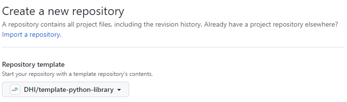

# my_library: Template Python repository

This repository is a starting point for **proprietary** Python libraries at DHI.
The shipped `LICENSE` is a proprietary "all rights reserved" notice and the
package metadata is configured to prevent accidental upload to public PyPI.
For open-source projects, use a different template.

## How do I use this?

1. Create a new repository in GitHub from this template
   

2. Change all occurrences of `my_library` to match the name of your new library.

3. Update `.github/CODEOWNERS` to your team or user.

4. Update author/URL placeholders in `pyproject.toml`.

5. Review `.github/workflows/python_publish.yml` before cutting a release.
   Publishing is intentionally not wired up — add a step targeting the internal
   index (devpi, once available) when you're ready to release.

6. If you keep `.github/workflows/docs.yml`, set the repository's Pages
   visibility to **private** in repo Settings → Pages (available on DHI's
   GitHub Enterprise Cloud plan). The default is public.

## Should I commit `uv.lock`?

This template intentionally does not commit `uv.lock`. For a library, that is
usually the right default:

- A library's lock file does not propagate to consumers — pip/uv resolve
  dependencies from your `pyproject.toml` constraints, not from your lock.
- Letting CI install against current versions of your declared dependencies
  surfaces upstream breaking changes early, while you can still react.
- It matches the convention of the wider scientific Python ecosystem
  (numpy, pandas, scipy, scikit-learn all omit their lock files).

Commit `uv.lock` when the repo is really an application or service (a CLI
shipped to end users, a deployed pipeline, a notebook bundle reproduced on a
schedule) — anywhere a fully resolved, reproducible environment matters more
than catching dependency drift early.

## When this template isn't the right fit

This is a fork-and-edit GitHub template — simple, but every derived repo
diverges over time. If you need parameterized scaffolding or a way to roll
template improvements back into existing repos, look at
[Copier](https://copier.readthedocs.io/) or
[Cookiecutter](https://cookiecutter.readthedocs.io/) instead.

## `just` installation

This template uses [`just`](https://just.systems/) as a command runner. See the
[just installation guide](https://just.systems/man/en/installation.html).

## Additional resources

- [Python Package Development at DHI](https://dhi.github.io/python-package-development/)
- [Scientific Python Library Development Guide](https://learn.scientific-python.org/development/)
